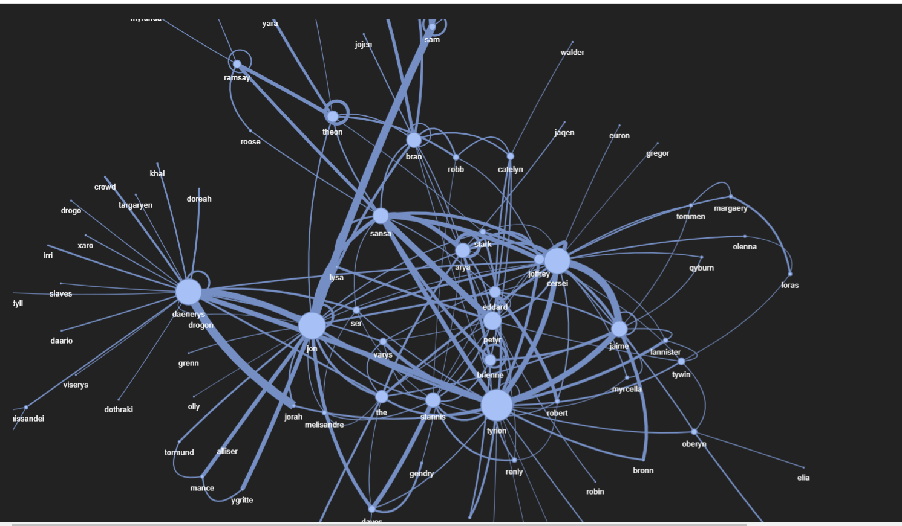

# Character Network Generator

## Background

This project generates a character network from the subtitles of the "Game of Thrones" series. By leveraging named entity recognition (NER) techniques, it identifies character interactions and visualizes them as a network graph.

## Working

1. **Setup and Dependencies**

   The project uses libraries such as `spacy`, `nltk`, `pandas`, `numpy`, `matplotlib`, `networkx`, and `pyvis` for various tasks including model loading, data manipulation, and visualization.

2. **Named Entity Recognition (NER)**

   Utilizes the `spacy` library with the `en_core_web_trf` model to perform named entity recognition on the subtitles.

3. **Dataset Loading and Preprocessing**

   Reads the subtitles dataset from `GOT.csv` and processes the data to aggregate sentences per season and episode.

4. **Character Mapping**

   Maps characters to their aliases to ensure consistent identification across different mentions.

5. **NER Inference**

   Applies the NER model to the subtitles to extract character names and their interactions.

6. **Generate Character Network**

   Creates a network graph of character interactions using `networkx` and visualizes it with `pyvis`.

## Results

Here is an example of how to use the character network generator:

[View Character Network](results/got2.html)

