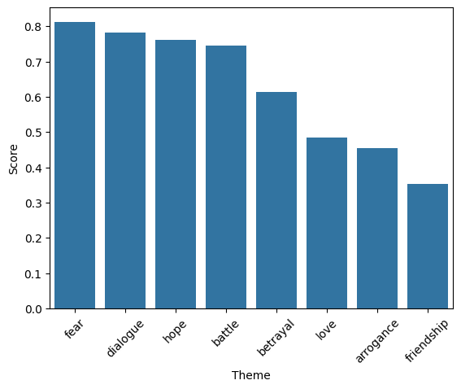

# Theme Classification

## Background

This project performs theme classification on the subtitles of the "Game of Thrones" series. By leveraging natural language processing (NLP) techniques, it identifies and visualizes underlying themes such as friendship, hope, betrayal, and more within the dialogue of each episode.

## Working

1. **Setup and Dependencies**

   The project uses libraries such as `transformers`, `nltk`, `pandas`, `numpy`, `torch`, `matplotlib`, and `seaborn` for various tasks including model loading, data manipulation, and visualization.

2. **Model Loading**

   Utilizes the `facebook/bart-large-mnli` model for zero-shot classification, configured to run on a GPU if available.

3. **Dataset Loading and Preprocessing**

   Reads the subtitles dataset from `GOT.csv` and processes the data to aggregate sentences per season and episode.

4. **Theme Inference**

   Defines a list of themes to classify, processes the subtitles in batches, applies the theme classifier, and aggregates the scores for each theme.

5. **Visualization**

   Creates a bar plot to visualize the scores of each theme.

## Example

Here is an example of how to use the theme classification:

```python

theme_list = ["friendship","hope","arrogance","battle","fear","betrayal","love","dialogue"]

```

## Results


